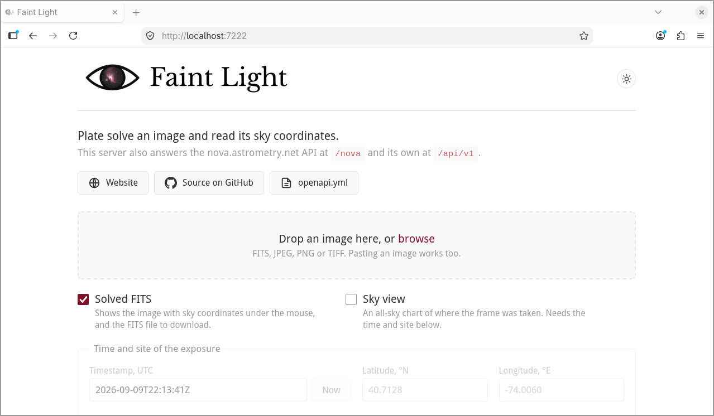
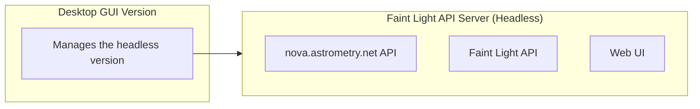
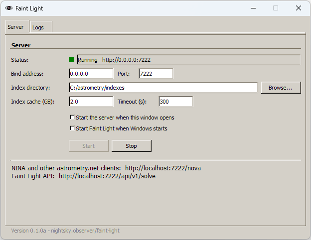

#  Faint Light

Fast plate-solving/astrometry.

It implements the same nova.astrometry.net HTTP API, so you can use it as a drop-in replacement.  
Solves 10-100× faster using the same index files.

***Warning:** This project is still in beta. Currently solving 99.2% of the images tested.*


Full benchmark, method and the other charts:  
[https://nightsky.observer/faint-light](https://nightsky.observer/faint-light/)

## Features

- **Native Rust solver**: mmaps stock astrometry.net index files (4100/4200/5000 series) and traverses their libkd kd-trees directly without C dependencies, neither format conversion.
- **Warm-start** (not used for the benchmark): the server remembers your last few solves. If the next image is near the previous one, it checks the old solution against the new stars instead of searching again, in under 10 ms. If you slewed somewhere else, it still knows your pixel scale and searches less. Useful because NINA and some other programs sends no hints at all.
- **In-memory index cache** (not used for the benchmark): A configurable RAM budget (`FAINT_LIGHT_CACHE_GB`) that prefetches the indexes relevant to your rig.
- Blind fallback always remains: first-ever solve works with zero hints. **The benchmark was created using blind solves.**
- [Solved FITS and sky charts](#faint-light-api) (Bonus): one solve call can also hand back the image as a FITS carrying its WCS, and an all-sky chart of where the frame was taken.
- **Web UI:** Open `http://localhost:7222/` in a browser to plate solve from there.
- [Desktop GUI](docs/GUI.md) (Optional): a small cross-platform window to run the server and read its log. Off by default. Mainly created for Windows users.



## Documentation

- [Releases](docs/Releases.md) - prebuilt binaries, supported platforms, and releasing
- [Desktop GUI](docs/GUI.md) - the optional desktop GUI
- [Windows](docs/Windows.md) - building and running natively on Windows
- [`openapi.yml`](openapi.yml) - the complete API contract

## Quick start

The **headless version** includes just the Faint Light API Server. The **desktop GUI version** includes both the Faint Light API Server and a simple Windows-like desktop GUI. The desktop GUI was designed for Windows users that want to avoid Docker and CLIs. It's just for setting the server on/off, and basic configuration. Plate-solving and other features are done via the API or the web UI, which both versions have.



### Headless

Put [astrometry.net index files](https://data.astrometry.net/) in `./indexes` or set `FAINT_LIGHT_INDEX_DIR` (see `scripts/download_indexes.sh` for downloading it).

#### Using Docker

```bash
docker compose up -d --build
```

#### Without Docker (Manual compilation)

```bash
FAINT_LIGHT_INDEX_DIR=./indexes cargo run --release -p fl-server
```

#### Testing Setup

Test a submission end to end:

```bash
./scripts/test_submission.sh path/to/image.jpg localhost:7222
```

### Desktop GUI

Just configure the index directory to point to the [astrometry.net index files](https://data.astrometry.net/) path on your computer, make sure the index cache in GB is set to a comfortable amount and start the server. For more information about this GUI, check its [documentation](docs/GUI.md).



## NINA Integration

In **NINA -> Options -> Plate Solving -> Astrometry.net**, set the API URL to:  
`http://localhost:7222/nova` **(note the `/nova`)**

And you can use any API key (it's ignored).

That's it.

## Web UI

With the server running, open [http://localhost:7222/](http://localhost:7222/). Drop in a FITS, JPEG, PNG or TIFF and press Solve.

## Configuration (environment variables)

| Variable | Default | Meaning |
|---|---|---|
| `FAINT_LIGHT_BIND` | `0.0.0.0` | Interface to listen on. `127.0.0.1` keeps the server to this machine |
| `FAINT_LIGHT_PORT` | `7222` | HTTP port |
| `FAINT_LIGHT_INDEX_DIR` | `/index`, else `./indexes` | Directory of `index-*.fits` files |
| `FAINT_LIGHT_CACHE_GB` | `2.0` | RAM budget for prefetching/pinning index data |
| `FAINT_LIGHT_SCALE_LOW` / `FAINT_LIGHT_SCALE_HIGH` | unset | Your rig's pixel scale range (arcsec/px). Optional, but makes the first solve after a restart as fast as a warm one |
| `FAINT_LIGHT_SOLVE_TIMEOUT` | `300` | Per-job solve timeout (seconds) |
| `FAINT_LIGHT_FAKE` | unset | `1` = return canned solutions (API testing without indexes) |
| `RUST_LOG` | `info` | Log filter |

## API

The complete contract, every endpoint, parameter and response, is specified in [`openapi.yml`](openapi.yml).

| Path | What |
|---|---|
| `/api/v1/...` | The Faint Light API (Plate-solving and custom features) |
| `/nova/...` | The nova.astrometry.net contract, for NINA and other clients (Plate-solving only) |
| `/` | The web UI |

### nova.astrometry.net API

Served under `/nova`, both with and without trailing slashes. Any or no API key works, authentication is bypassed.

Not implemented: `url_upload`, annotated preview images, SIP distortion polynomials (NINA consumes none of these).

### Faint Light API

`POST /api/v1/solve` solves an image **synchronously**, no polling.

```bash
curl -X POST http://localhost:7222/api/v1/solve -F file=@image.jpg
```

```json
{
  "status": "success",
  "job": 2,
  "solved_in_ms": 324,
  "image": {
    "width": 1024,
    "height": 1024
  },
  "calibration": {
    "ra": 83.8182,
    "dec": -5.3882,
    "pixscale": 14.0687,
    "...": "..."
  },
  "wcs": {
    "crval": [
      83.8182,
      -5.3882
    ],
    "crpix": [
      512.5,
      512.5
    ],
    "cd": [
      [
        -0.00391,
        0
      ],
      [
        0,
        -0.00391
      ]
    ]
  },
  "match": {
    "logodds": 193.2,
    "nmatch": 41,
    "index_id": 4111
  }
}
```

Three flags decide what else it produces:

| Field | Effect |
|---|---|
| `fits=1` | Adds `fits_url`: the image as FITS carrying the solution. A FITS upload comes back as it arrived, same pixels, same cards, with only its WCS keywords replaced. Anything else becomes a 32-bit float image HDU |
| `skyview=1` | Adds a `skyview` object with the field's alt/az and `chart_url`. Needs `timestamp`, `latitude` and `longitude` |
| `preview=1` | Adds `preview_url`: the upload as an auto-stretched greyscale PNG, at most 2048 px on its longest edge, plus a `preview` object with its size and reduction factor. What the web UI shows |

Optional solve hints: `scale_low`/`scale_high` (arcsec/px), `center_ra`/`center_dec`/`radius` (degrees), `downsample`, `parity`.

Both outputs are fetched from the URLs the response reports:

```bash
curl -X POST http://localhost:7222/api/v1/solve \
  -F file=@image.jpg -F fits=1 -F skyview=1 \
  -F timestamp=2026-07-13T02:10:00Z -F latitude=40.7128 -F longitude=-74.0060

curl -O http://localhost:7222/api/v1/jobs/2/fits
curl -O http://localhost:7222/api/v1/jobs/2/skyview.svg
curl -O http://localhost:7222/api/v1/jobs/2/preview.png   # with -F preview=1
```

The chart below, for [this frame of Messier 22](https://fschuindt.722.network/2026/07/31/messier-22.html):


*A 3.13° × 2.05° frame of Messier 22, placed in the sky over the observer's site at the time of exposure.*

Constellation figures are derived from [d3-celestial](https://github.com/ofrohn/d3-celestial) (BSD-3-Clause).

## Development

```bash
# Unit tests
cargo test

# + golden tests vs real index files
FAINT_LIGHT_TEST_INDEX_DIR=~/indexes cargo test --release
./scripts/bench_vs_astrometry.sh localhost:7222/nova reference-host:8000 image.jpg

# The optional GUI
cargo run --release -p fl-server --features gui --bin faint-light-gui
cargo test -p fl-server --features gui

# The debugging commands
cargo build --release -p fl-server --features tools
./target/release/faint-light-tools solve --index-dir ./indexes image.jpg
./target/release/faint-light-tools extract image.jpg
./target/release/faint-light-tools index-dump ./indexes/index-4110.fits
```

A plain build produces one executable, `faint-light`. The GUI and the debugging commands are separate `--features` so they stay out of the way.

The released version is the single line in [`VERSION`](VERSION), see [Releases](docs/Releases.md) for how it is used and how to cut one.

Layout:

- `fl-fits` - minimal FITS reader and writer (headers, HDU offsets, image HDUs, WCS injection)
- `fl-index` - astrometry.net index files: mmap, libkd kd-tree traversal, quads
- `fl-extract` - image decoding + simplexy-style star extraction
- `fl-solve` - geometric-hash quad matching, TAN WCS fitting (Procrustes), log-odds verification, warm-start engine
- `fl-sky` - alt/az sky charts: embedded constellation figures, sidereal time / horizontal coordinates, SVG rendering
- `fl-server` - axum HTTP server (`v1` and `nova` routers over a shared solve worker and job store, and the web UI from `crates/fl-server/web/`, embedded at build time); behind `--features gui` the FLTK front end, behind `--features tools` the debugging commands

## License

Apache License 2.0. See [LICENSE](LICENSE).
