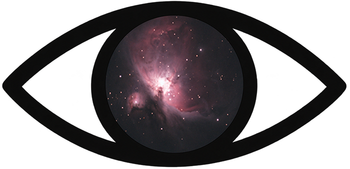
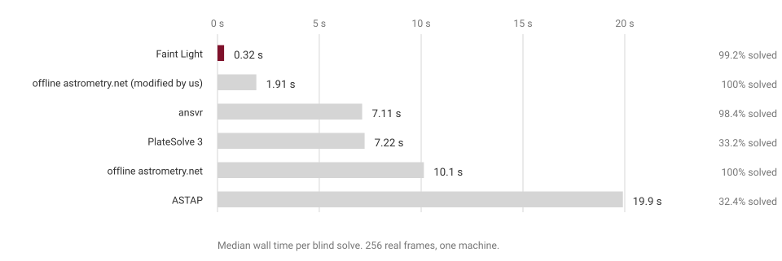
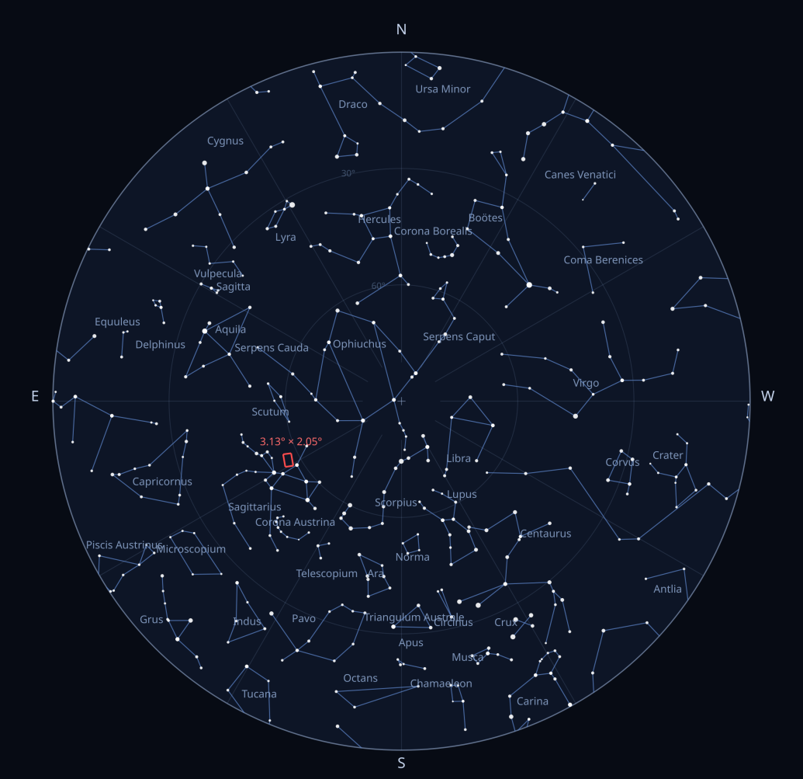

#  Faint Light

Fast plate-solving/astrometry.

It implements the same nova.astrometry.net HTTP API, so you can use it as a drop-in replacement.  
Solves 10-100× faster using the same index files.

***Warning:** This project is still in beta. Currently solving 99.2% of the images tested.*



Full benchmark, method and the other charts:  
[https://nightsky.observer/faint-light](https://nightsky.observer/faint-light/)

## Features

- **Native Rust solver**: mmaps stock astrometry.net index files (4100/4200/5000 series) and traverses their libkd kd-trees directly without C dependencies, neither format conversion.
- **Warm-start** (not used for the benchmark): the server remembers your last few solves. If the next image is near the previous one, it checks the old solution against the new stars instead of searching again, in under 10 ms. If you slewed somewhere else, it still knows your pixel scale and searches less. Useful because NINA sends no hints at all.
- **In-memory index cache** (not used for the benchmark): A configurable RAM budget (`FAINT_LIGHT_CACHE_GB`) that prefetches the indexes relevant to your rig.
- Blind fallback always remains: first-ever solve works with zero hints.
- [Skyview](#skyview-faint_light-extension) (Bonus): Builds an image of the all-sky chart and FOV of the image solved.

## Quick start

Put astrometry.net index files in `./indexes` or set `FAINT_LIGHT_INDEX_DIR` (see `scripts/download_indexes.sh` for downloading it).

### Using Docker

```bash
docker compose up -d --build
```

### Without Docker (Manual compilation)

```bash
FAINT_LIGHT_INDEX_DIR=./indexes cargo run --release -p fl-server
```

### Testing Setup

Test a submission end to end:

```bash
./scripts/test_submission.sh path/to/image.jpg localhost:8000
```

### NINA Integration
In **NINA -> Options -> Plate Solving -> Astrometry.net**, set the API URL to `http://localhost:8000` and any API key (it is ignored). That's it.

## Configuration (environment variables)

| Variable | Default | Meaning |
|---|---|---|
| `FAINT_LIGHT_PORT` | `8000` | HTTP port |
| `FAINT_LIGHT_INDEX_DIR` | `/index`, else `./indexes` | Directory of `index-*.fits` files |
| `FAINT_LIGHT_CACHE_GB` | `2.0` | RAM budget for prefetching/pinning index data |
| `FAINT_LIGHT_SCALE_LOW` / `FAINT_LIGHT_SCALE_HIGH` | unset | Your rig's pixel scale range (arcsec/px). Optional, but makes the first solve after a restart as fast as a warm one |
| `FAINT_LIGHT_SOLVE_TIMEOUT` | `300` | Per-job solve timeout (seconds) |
| `FAINT_LIGHT_FAKE` | unset | `1` = return canned solutions (API testing without indexes) |
| `RUST_LOG` | `info` | Log filter |

## API surface

The complete contract, every endpoint, parameters and response, is specified in [`openapi.yml`](openapi.yml).

Implemented the same nova.astrometry.net contract, both with and without trailing slashes. For authentication, any or no API key works, it's bypassed.

Not implemented: `url_upload`, annotated preview images, SIP distortion polynomials (NINA consumes none of these).

### Skyview

`POST /api/skyview` solves an image **synchronously** and renders an all-sky chart showing where in the local sky the picture was taken.

**Example**

**Input image:** [https://fschuindt.722.network/2026/07/31/messier-22.html](https://fschuindt.722.network/2026/07/31/messier-22.html)

```bash
curl -X POST http://localhost:8000/api/skyview \
  -F file=@input_image.jpg -F timestamp=2026-07-13T02:10:00Z \
  -F latitude=40.7128 -F longitude=-74.0060
```

Outputs:



*A 3.13° × 2.05° frame of Messier 22, placed in the sky over the observer's site at the time of exposure.*

Constellation figures are derived from [d3-celestial](https://github.com/ofrohn/d3-celestial) (BSD-3-Clause).

## Development

```bash
# Unit tests
cargo test

# + golden tests vs real index files
FAINT_LIGHT_TEST_INDEX_DIR=~/indexes cargo test --release
cargo run --release -p fl-solve --bin fl-solve-cli -- --index-dir ./indexes image.jpg
cargo run --release -p fl-index --bin fl-index-dump ./indexes/index-4110.fits
./scripts/bench_vs_astrometry.sh localhost:8000 reference-host:8000 image.jpg
```

Layout:

- `fl-fits` - minimal FITS reader (headers, HDU offsets, image HDUs)
- `fl-index` - astrometry.net index files: mmap, libkd kd-tree traversal, quads
- `fl-extract` - image decoding + simplexy-style star extraction
- `fl-solve` - geometric-hash quad matching, TAN WCS fitting (Procrustes), log-odds verification, warm-start engine
- `fl-sky` - alt/az sky charts: embedded constellation figures, sidereal time / horizontal coordinates, SVG rendering
- `fl-server` - axum HTTP server, in-memory job store, solve worker

## License

Apache License 2.0. See [LICENSE](LICENSE).
